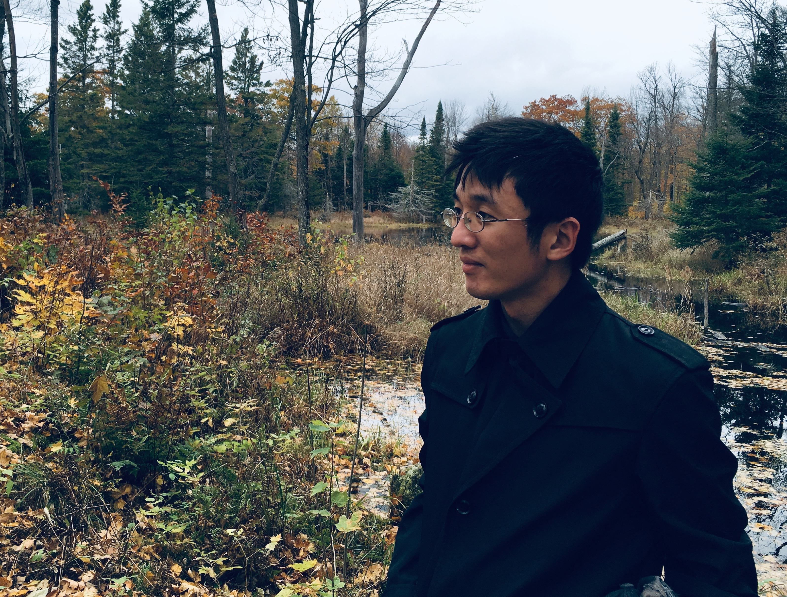

My name is **Yi-Hsuan Lin** (林義軒, Lén I-Chuèn for francophones).  
 
I am a theoretical physics PhD fond of all kinds of sciences and technology topics,
particularly focusing on "biophysical chemistry" or other equivalent subjects 
at the intersection of physics, chemistry, and biology.  

Recently, I'm interested in new computational methods, from classical to quantum 
mechanics techniques, for structural-based molecular modeling.  

This website is where I deposit my coding projects, technique implementation practices,
and some math and sciences study notes.

<!--I code mainly in Python3 with Numpy, Scipy, Pandas, and Scikit-learn, 
and have experience in C/C++ for linear algebra, differential equations, 
and Monte Carlo simulation.-->

